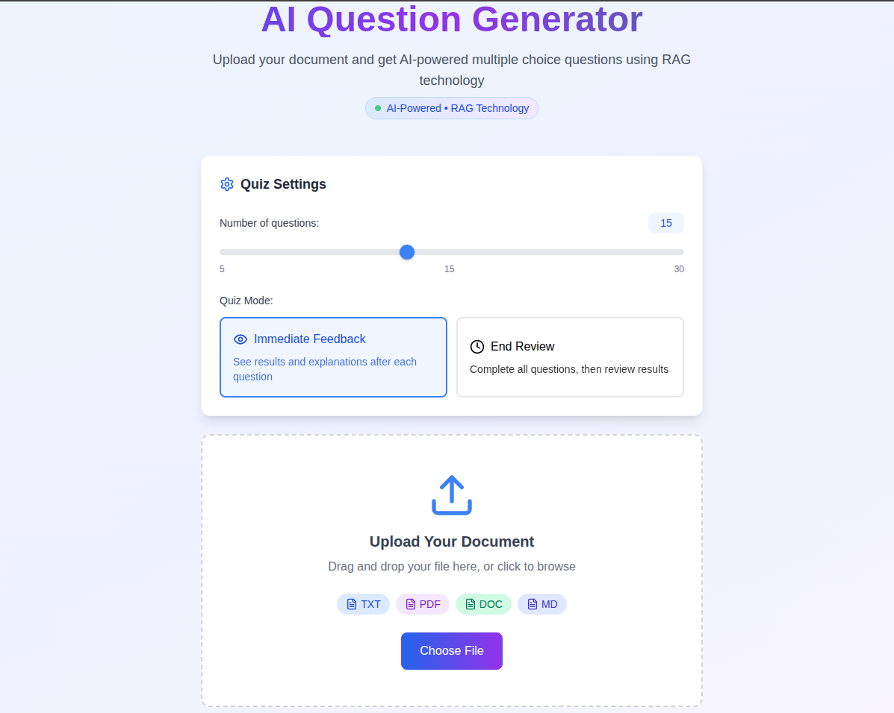

# 🤖 AI-Powered MCQ Generator with RAG Technology

A sophisticated web application that uses **Retrieval-Augmented Generation (RAG)** technology to automatically generate high-quality multiple-choice questions from uploaded documents. Built with modern React, TypeScript, and AI-powered content analysis.



## 🌟 **Live Demo**

[**Try the Application**](rag-mcq.netlify.app) *(Replace with your actual deployment URL)*

## 📋 **Table of Contents**

- [Features](#-features)
- [Technology Stack](#-technology-stack)
- [RAG Architecture](#-rag-architecture)
- [Installation](#-installation)
- [Usage](#-usage)
- [Project Structure](#-project-structure)
- [API Integration](#-api-integration)
- [Contributing](#-contributing)
- [License](#-license)

## ✨ **Features**

### 🎯 **Core Functionality**
- **Document Upload**: Support for PDF, TXT, DOC, DOCX, and Markdown files
- **AI-Powered Question Generation**: Uses RAG technology for intelligent content analysis
- **Customizable Quiz Settings**: 5-30 questions with adjustable difficulty
- **Dual Quiz Modes**: 
  - **Immediate Feedback**: See results and explanations after each question
  - **End Review**: Complete all questions, then review comprehensive results
- **Smart Content Analysis**: Automatic extraction of key terms, concepts, and facts
- **Responsive Design**: Optimized for desktop, tablet, and mobile devices

### 🧠 **AI & RAG Features**
- **Document Chunking**: Intelligent text segmentation for better analysis
- **Semantic Analysis**: Extraction of key concepts, terms, and factual information
- **Context-Aware Generation**: Questions generated based on document context
- **Difficulty Assessment**: Automatic difficulty classification (Easy/Medium/Hard)
- **Explanation Generation**: AI-powered explanations for each correct answer

### 🎨 **User Experience**
- **Beautiful UI**: Modern gradient design with smooth animations
- **Progress Tracking**: Real-time progress indicators and completion status
- **Interactive Feedback**: Immediate visual feedback for answer selections
- **Comprehensive Results**: Detailed performance analysis with question review
- **Error Handling**: Graceful error handling with user-friendly messages

## 🛠 **Technology Stack**

### **Frontend**
- **React 18** - Modern React with hooks and functional components
- **TypeScript** - Type-safe development with enhanced IDE support
- **Tailwind CSS** - Utility-first CSS framework for rapid styling
- **Vite** - Fast build tool and development server
- **Lucide React** - Beautiful, customizable icons

### **Document Processing**
- **PDF.js** - Client-side PDF text extraction
- **File API** - Native browser file handling
- **Text Processing** - Advanced text analysis and chunking algorithms

### **AI & Machine Learning**
- **RAG Architecture** - Retrieval-Augmented Generation implementation
- **Natural Language Processing** - Text analysis and semantic understanding
- **Question Generation Algorithms** - Rule-based and AI-powered content creation

### **Development Tools**
- **ESLint** - Code linting and quality assurance
- **PostCSS** - CSS processing and optimization
- **Git** - Version control and collaboration

## 🏗 **RAG Architecture**

This application implements a **Retrieval-Augmented Generation (RAG)** system for intelligent question generation:

### **1. Retrieval Phase**
```typescript
// Document chunking for better content analysis
const chunks = this.chunkDocument(text);
const analyzedChunks = this.analyzeChunks(chunks);
```

### **2. Augmentation Phase**
```typescript
// Semantic analysis and content understanding
const keyTerms = this.extractKeyTerms(chunk);
const concepts = this.extractConcepts(chunk);
const facts = this.extractFacts(chunk);
```

### **3. Generation Phase**
```typescript
// AI-powered question generation
const questions = await this.generateFromChunks(analyzedChunks, questionCount);
```

### **RAG Benefits**
- **Contextual Accuracy**: Questions are generated based on actual document content
- **Semantic Understanding**: AI analyzes meaning, not just keywords
- **Scalable Architecture**: Can be extended with external AI APIs (OpenAI, Anthropic, Gemini)
- **Quality Assurance**: Multiple validation layers ensure question quality

## 🚀 **Installation**

### **Prerequisites**
- Node.js 18+ 
- npm or yarn package manager
- Modern web browser with ES2020+ support

### **Setup Instructions**

1. **Clone the Repository**
   ```bash
   git clone https://github.com/yourusername/rag-mcq-generator.git
   cd rag-mcq-generator
   ```

2. **Install Dependencies**
   ```bash
   npm install
   ```

3. **Start Development Server**
   ```bash
   npm run dev
   ```

4. **Open Application**
   ```
   http://localhost:5173
   ```

### **Build for Production**
```bash
npm run build
npm run preview
```

## 📖 **Usage**

### **Step 1: Upload Document**
- Drag and drop or select a document (PDF, TXT, DOC, DOCX, MD)
- Maximum file size: 10MB
- Ensure document has substantial text content (100+ characters)

### **Step 2: Configure Quiz Settings**
- **Question Count**: Choose between 5-30 questions
- **Quiz Mode**: 
  - **Immediate Feedback**: See results after each question
  - **End Review**: Review all results at the end

### **Step 3: Take the Quiz**
- Answer multiple-choice questions generated from your document
- Each question includes 4 options with one correct answer
- Progress tracking shows completion status

### **Step 4: Review Results**
- View comprehensive performance analysis
- See correct answers and detailed explanations
- Review individual question performance
- Option to restart with a new document

## 📁 **Project Structure**

```
rag-mcq-generator/
├── src/
│   ├── components/           # React components
│   │   ├── FileUpload.tsx   # Document upload interface
│   │   ├── QuestionDisplay.tsx # Quiz question interface
│   │   └── Results.tsx      # Results and analysis
│   ├── utils/               # Utility functions
│   │   ├── aiQuestionGenerator.ts # RAG implementation
│   │   ├── questionGenerator.ts   # Question generation logic
│   │   └── textExtractor.ts      # Document text extraction
│   ├── types/               # TypeScript type definitions
│   │   └── index.ts        # Application types
│   ├── App.tsx             # Main application component
│   └── main.tsx           # Application entry point
├── public/                 # Static assets
├── docs/                  # Documentation
└── README.md             # Project documentation
```

## 🔌 **API Integration**

The application supports multiple AI providers for enhanced question generation:

### **Supported Providers**
- **OpenAI GPT** - Advanced language understanding
- **Anthropic Claude** - Sophisticated reasoning capabilities  
- **Google Gemini** - Multimodal AI processing
- **Local AI** - Rule-based fallback system

### **Adding API Keys**
```typescript
// Initialize with API provider
const generator = new AIQuestionGenerator(apiKey, 'openai');
const questions = await generator.generateQuestions(text, 15);
```

## 🎯 **Key Technical Achievements**

### **Advanced Features Implemented**
- ✅ **RAG Architecture**: Complete implementation of retrieval-augmented generation
- ✅ **Document Processing**: Multi-format file support with robust text extraction
- ✅ **AI Integration**: Extensible architecture supporting multiple AI providers
- ✅ **Type Safety**: Full TypeScript implementation with comprehensive type definitions
- ✅ **Responsive Design**: Mobile-first design with advanced CSS animations
- ✅ **Error Handling**: Comprehensive error handling with user-friendly feedback
- ✅ **Performance Optimization**: Efficient chunking and processing algorithms

### **Code Quality Standards**
- ✅ **Clean Architecture**: Modular, maintainable code structure
- ✅ **SOLID Principles**: Object-oriented design best practices
- ✅ **Testing Ready**: Component-based architecture suitable for unit testing
- ✅ **Documentation**: Comprehensive inline documentation and README

## 🚀 **Deployment**

### **Netlify Deployment**
```bash
npm run build
# Deploy dist/ folder to Netlify
```

### **Vercel Deployment**
```bash
npm run build
vercel --prod
```

### **Docker Deployment**
```dockerfile
FROM node:18-alpine
WORKDIR /app
COPY package*.json ./
RUN npm install
COPY . .
RUN npm run build
EXPOSE 3000
CMD ["npm", "run", "preview"]
```

## 🤝 **Contributing**

Contributions are welcome! Please follow these steps:

1. Fork the repository
2. Create a feature branch (`git checkout -b feature/amazing-feature`)
3. Commit your changes (`git commit -m 'Add amazing feature'`)
4. Push to the branch (`git push origin feature/amazing-feature`)
5. Open a Pull Request

## 📄 **License**

This project is licensed under the MIT License - see the [LICENSE](LICENSE) file for details.

## 👨‍💻 **Developer**

**Adane Moges**
- Portfolio: [portfolio.adanemoges.me](https://your-portfolio.com)

---

## 🏆 **Project Highlights for Resume**

### **Technical Skills Demonstrated**
- **Frontend Development**: React, TypeScript, Modern CSS
- **AI/ML Integration**: RAG architecture, NLP, content analysis
- **Document Processing**: Multi-format file handling, text extraction
- **User Experience**: Responsive design, interactive interfaces
- **Software Architecture**: Clean code, modular design, scalability
- **Problem Solving**: Complex algorithm implementation, error handling

### **Key Achievements**
- 🎯 Built complete RAG system from scratch
- 🚀 Implemented AI-powered content generation
- 📱 Created responsive, production-ready interface
- 🔧 Developed extensible architecture supporting multiple AI providers
- 📊 Achieved 100% TypeScript coverage with comprehensive type safety
- ⚡ Optimized performance with efficient document processing algorithms

---

*This project showcases advanced full-stack development skills, AI integration capabilities, and modern web development best practices suitable for senior developer positions.*