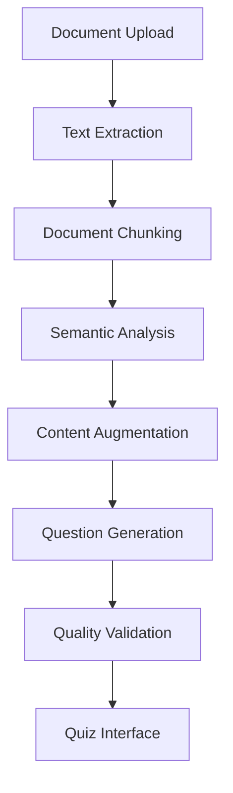

# 🔧 Technical Documentation

## Architecture Overview

### RAG (Retrieval-Augmented Generation) Implementation

The application implements a sophisticated RAG system for intelligent question generation:



## Core Components

### 1. Document Processing Pipeline

```typescript
// Text extraction with multi-format support
export async function extractTextFromFile(file: File): Promise<string> {
  // PDF processing using PDF.js
  // Text file processing
  // Word document handling
  // Markdown processing
}

```

### 2. RAG Question Generator

```typescript
export class AIQuestionGenerator {
  // Document chunking for better analysis
  private chunkDocument(text: string): string[]
  
  // Semantic analysis and content understanding
  private analyzeChunks(chunks: string[]): AnalyzedChunk[]
  
  // AI-powered question generation
  private generateFromChunks(chunks: AnalyzedChunk[], count: number): Question[]
}
```

### 3. Quiz State Management

```typescript
type QuizState = 'upload' | 'quiz' | 'results';
type QuizMode = 'immediate' | 'end';

interface QuizSettings {
  questionCount: number;
  mode: QuizMode;
}
```

## Performance Optimizations

### Document Chunking Strategy
- **Overlapping Chunks**: 3-5 sentences per chunk with 2-sentence overlap
- **Semantic Boundaries**: Respect sentence and paragraph boundaries
- **Size Optimization**: Optimal chunk size for content analysis

### Memory Management
- **Lazy Loading**: Components loaded on demand
- **Efficient State**: Minimal state updates and re-renders
- **Cleanup**: Proper cleanup of file readers and event listeners

## Error Handling

### Graceful Degradation
```typescript
try {
  const aiQuestions = await generateQuestionsWithAI(text, count);
  return aiQuestions;
} catch (error) {
  console.error('AI generation failed, falling back to rule-based');
  return generateFallbackQuestions(text, count);
}
```

### User-Friendly Error Messages
- File size validation
- Format compatibility checks
- Content length validation
- Processing timeout handling

## Security Considerations

### File Upload Security
- File type validation
- Size limitations (10MB max)
- Content sanitization
- Client-side processing only

### Data Privacy
- No server-side storage
- Local processing only
- No external API calls by default
- User data never leaves the browser

## Testing Strategy

### Unit Testing
```typescript
// Component testing with React Testing Library
// Utility function testing with Jest
// Type safety validation with TypeScript
```

### Integration Testing
```typescript
// End-to-end user flows
// File upload and processing
// Question generation pipeline
// Quiz completion workflow
```

## Deployment Architecture

### Static Site Deployment
- **Build Process**: Vite optimization and bundling
- **Asset Optimization**: Image compression and lazy loading
- **CDN Integration**: Fast global content delivery
- **Progressive Web App**: Service worker for offline functionality

### Environment Configuration
```typescript
// Development environment
VITE_NODE_ENV=development
VITE_API_BASE_URL=http://localhost:5173

// Production environment  
VITE_NODE_ENV=production
VITE_API_BASE_URL=https://your-domain.com
```

## Scalability Considerations

### Horizontal Scaling
- **Microservices Architecture**: Separate services for different functionalities
- **API Gateway**: Centralized request routing and management
- **Load Balancing**: Distribute traffic across multiple instances

### Performance Monitoring
- **Core Web Vitals**: LCP, FID, CLS optimization
- **Bundle Analysis**: Code splitting and lazy loading
- **Error Tracking**: Comprehensive error monitoring and reporting

## Future Enhancements

### AI Provider Integration
```typescript
// OpenAI GPT integration
const openAIGenerator = new AIQuestionGenerator(apiKey, 'openai');

// Anthropic Claude integration  
const claudeGenerator = new AIQuestionGenerator(apiKey, 'anthropic');

// Google Gemini integration
const geminiGenerator = new AIQuestionGenerator(apiKey, 'gemini');
```

### Advanced Features
- **Multi-language Support**: Internationalization and localization
- **Advanced Analytics**: Detailed performance metrics and insights
- **Collaborative Features**: Shared quizzes and team functionality
- **Export Capabilities**: PDF, Excel, and other format exports

## Code Quality Standards

### TypeScript Configuration
```json
{
  "compilerOptions": {
    "strict": true,
    "noUnusedLocals": true,
    "noUnusedParameters": true,
    "noFallthroughCasesInSwitch": true
  }
}
```

### ESLint Rules
```json
{
  "extends": [
    "@typescript-eslint/recommended",
    "plugin:react-hooks/recommended"
  ],
  "rules": {
    "react-refresh/only-export-components": "warn"
  }
}
```

### Code Organization
- **Single Responsibility**: Each component has one clear purpose
- **Separation of Concerns**: Logic, presentation, and data layers
- **Reusability**: Modular components and utility functions
- **Maintainability**: Clear naming conventions and documentation